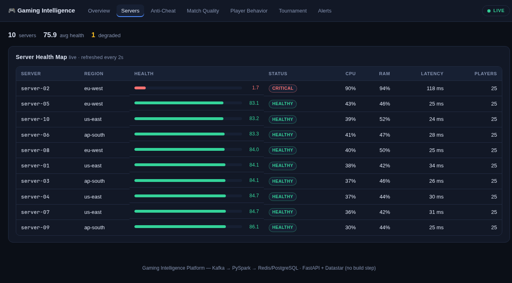
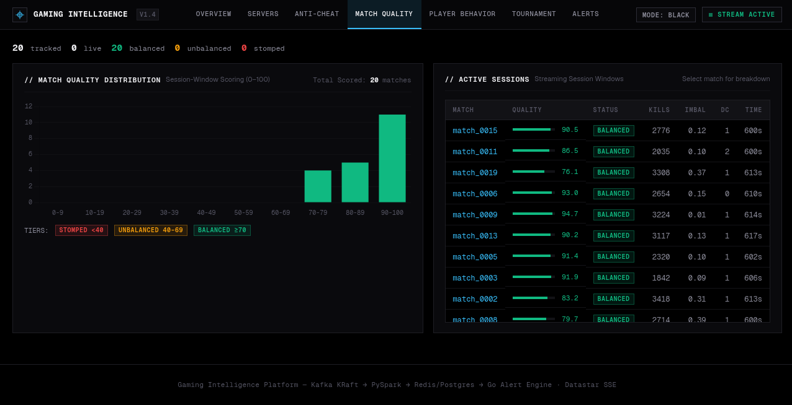
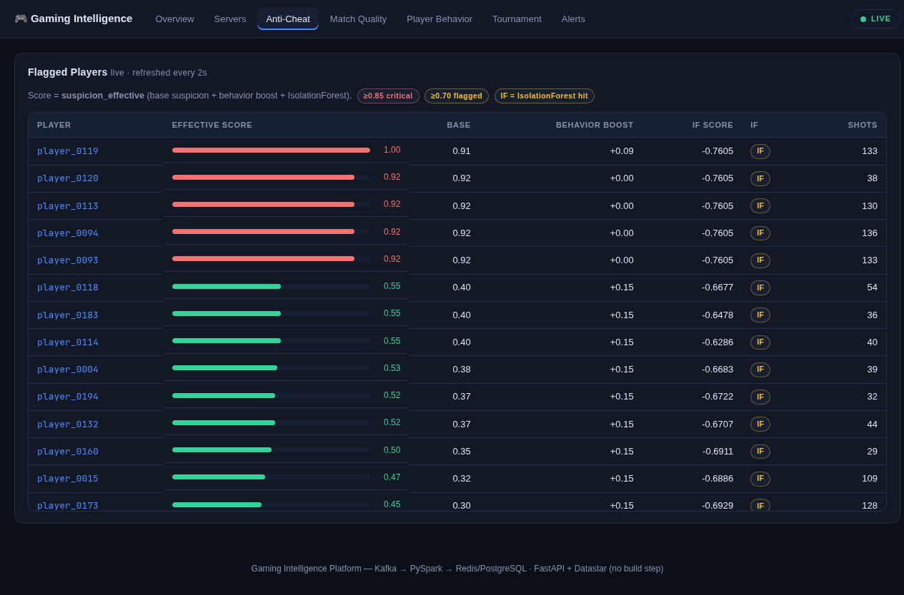
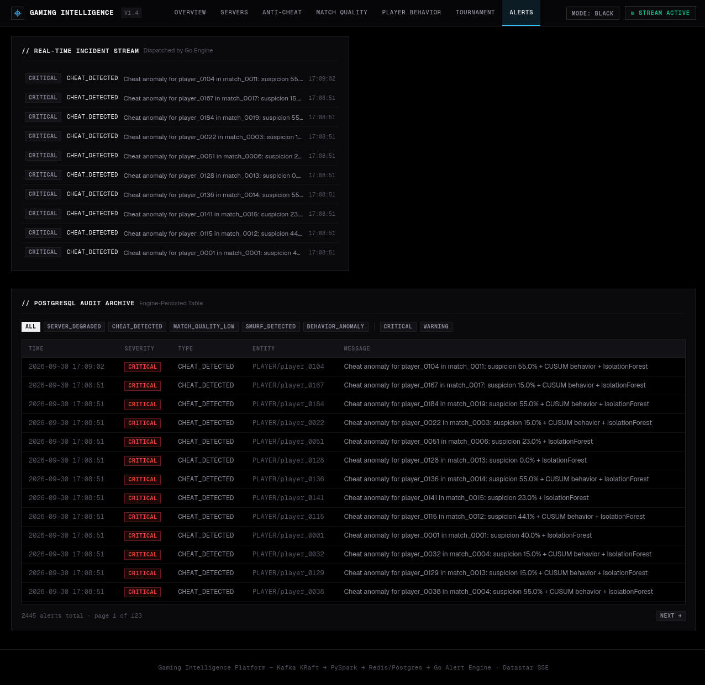

# Real-Time Competitive Gaming Intelligence Platform

A high-throughput, distributed streaming platform designed to monitor game server infrastructure, score match quality, profile player behavior, and detect anomalies (aimbots, smurfs) in real time using **Apache Kafka**, **Apache Spark Structured Streaming**, **Go**, and **PySpark**.

---

## Architecture

```text
                              SIMULATOR (Go)
             ┌────────────────────────┼────────────────────────┐
      gameplay events           player events            server metrics
   (one SHOT per trigger     (login, matchmaking,       (cpu, ram, tick,
    pull, outcome inline)     purchases, reports)        loss, latency)
             └────────────────────────┼────────────────────────┘
                                      ▼
                               KAFKA (KRaft)
             gameplay_events · player_events · server_metrics · alerts
                                      │
                                      ▼
                  SPARK STRUCTURED STREAMING — 4 drivers
     server_health · match_quality · cheat_detection · advanced_analytics
                                        (smurf · behavior change · economy)
             │                        │                          │
             ▼                        ▼                          ▼
      Redis (live state)     Kafka `alerts` topic      Parquet archive (local
             │                        │                disk, ./data/parquet)
             │                        ▼                          │
             │                Alert Engine (Go)                  ▼
             │           dedup + per-entity rate limit   Historical batch
             │           → Postgres alert_history        (make spark-batch)
             │           → Redis pub/sub alerts:stream
             │           → optional webhook
             ▼                        │
     FastAPI REST + WebSockets ◄──────┘
     + Datastar dashboard (:8000)
```

---

## Technology Stack

| Layer | Technology |
|---|---|
| **Event Simulator** | Go 1.25 (`kafka-go`, concurrent goroutines, paced per-topic producers) |
| **Ingestion** | Apache Kafka 3.7 (KRaft mode - no ZooKeeper) |
| **Stream Processing** | Apache Spark 3.5 (PySpark Structured Streaming, Sliding/Tumbling/Session Windows) |
| **Anomaly Model** | scikit-learn IsolationForest (trained offline, scored in `foreachBatch`) |
| **Real-Time Storage** | Redis 7 |
| **Persistent Storage** | PostgreSQL 16 (alert history) + Parquet archive on local disk |
| **Alert Engine** | Go 1.25 (`kafka-go`, `go-redis`, `pgx`) |
| **Backend API** | Python FastAPI + WebSockets |
| **Frontend** | Datastar v1.0.4 + Jinja2 SSR (SSE patches, zero build step) |

---

## Project Structure

```text
gaming-intelligence-platform/
├── docker-compose.yml              # Kafka (+ topic init), Spark, Redis, Postgres, API, alert engine
├── Makefile                        # Automation shortcuts (`make help`)
├── README.md                       # Project overview and setup instructions
├── LICENSE                         # MIT
├── .gitignore                      # Git ignore rules
├── schemas/                        # Avro event contracts
│   ├── gameplay_event.avsc
│   ├── player_event.avsc
│   ├── server_metric.avsc
│   └── alert.avsc
├── simulator/                      # Go Game Event Simulator
│   ├── go.mod
│   ├── cmd/simulator/              # config · profiles · world · combat · engine · sink
│   └── profiles/                   # Statistical player archetypes (YAML)
│       ├── normal_bronze.yaml
│       ├── normal_gold.yaml
│       ├── normal_diamond.yaml
│       ├── cheater_aimbot.yaml
│       ├── cheater_wallhack.yaml
│       ├── smurf.yaml
│       └── toxic.yaml
├── streaming/                      # PySpark Streaming Pipelines
│   ├── Dockerfile                  # apache/spark:3.5.1 + pinned Python deps
│   ├── requirements.txt
│   ├── models/                     # IsolationForest artifact (make train-model)
│   ├── src/
│   │   ├── common/
│   │   │   ├── config.py
│   │   │   ├── schemas.py
│   │   │   ├── alerts.py           # Redis dedup + batched Kafka alert flush
│   │   │   ├── sinks.py            # Parquet archive sink
│   │   │   └── runtime.py
│   │   ├── jobs/                   # Streaming analytics jobs (4 submit targets)
│   │   ├── ml/                     # IsolationForest scoring + offline training
│   │   └── batch/                  # historical_analysis.py (make spark-batch)
│   └── tests/                      # PySpark unit tests (make test-streaming)
├── alert-engine/                   # Go alert engine: Kafka alerts → dedup → Postgres / Redis / webhook
│   ├── Dockerfile
│   ├── go.mod
│   └── *.go                        # config · alert · gate · handler · sinks · main (+ tests)
├── api/                            # FastAPI REST, WebSocket & Dashboard
│   ├── requirements.txt
│   ├── main.py                     # REST + WS endpoints
│   ├── state.py                    # Shared feed / sampler / PG pool
│   ├── dashboard.py                # SSR views + Datastar SSE streams
│   ├── templates/                  # Jinja2 (7 tabs + drill-downs)
│   └── static/                     # dashboard.css
├── benchmarks/                     # Phase 6: tiered load benchmark + collector
│   ├── run_benchmark.sh
│   ├── collect.py
│   └── plot_results.py
└── docs/
    └── screenshots/
```

---

## Screenshots

**Overview** — live KPIs, event stream, alerts, flagged players:


**Server health map** — live health bars and status chips (server-02 is the
simulator's deliberately-degraded node):



**Match quality** — distribution histogram with per-match drill-down:



**Anti-cheat** — flagged players ranked by effective suspicion
(base score + behavior boost + IsolationForest):



**Alerts** — live feed pushed by the Go alert engine, plus the filterable
PostgreSQL `alert_history`:



---

## Quick Start

### 1. Launch the Infrastructure
```bash
make up
```

This starts:
- Kafka broker, reachable from the host at `localhost:9094` (containers use
  `kafka:9092`); a one-shot `kafka-init` container creates the four topics
  (broker auto-creation is off)
- Spark Master Web UI at [http://localhost:8080](http://localhost:8080)
- 2 Spark Workers (2 cores, 2GB memory each) with the Python ML packages installed
- Redis on port `6379`
- PostgreSQL on host port `5433` (container port `5432`)
- FastAPI backend + dashboard on port `8000` (starts after `kafka-init` has
  created the topics)
- Go alert engine (consumes the `alerts` topic; same start condition)

### 2. Verify Kafka Topics
```bash
make kafka-topics
```

### 3. Train the Anomaly Model
```bash
make train-model
```
Fits the IsolationForest on simulated normal play and writes
`streaming/models/anti_cheat_isolation_forest.joblib`. `cheat_detection` loads
it at start-up, so train before submitting the jobs (without it the job runs
on the heuristic score alone).

### 4. Submit the PySpark Streaming Jobs
There are four drivers. Submit them **one at a time**, waiting until each app
shows up as running in the Spark UI before the next — concurrent cold submits
race on the shared Ivy cache that `--packages` downloads into:
```bash
make spark-submit JOB=server_health
make spark-submit JOB=match_quality
make spark-submit JOB=cheat_detection
make spark-submit JOB=advanced_analytics   # smurf + behavior change + economy
```
Each driver is capped at 1 core, so the four exactly fill the 4-core cluster.
`make spark-submit` stays attached to the driver; run each in its own terminal.

### 5. Run Event Simulator
Run against local Kafka:
```bash
make simulator-run
```
Or test locally without Kafka running (dry-run mode):
```bash
make simulator-dry-run
```

### 6. Open the API and Dashboard
The API is already running from `make up`. Interactive Swagger docs are at
[http://localhost:8000/docs](http://localhost:8000/docs).

The live dashboard is served from the same server at [http://localhost:8000/](http://localhost:8000/) —
server-rendered HTML with Datastar SSE patches (no build step, no separate frontend container).
After changing anything under `api/`, rebuild and restart it with `make api-up`.

### 7. Batch Analysis and Benchmark
```bash
make spark-batch JOB=all     # or skill, weapon, cheat, quality, servers, peak
make benchmark               # tiered load test, 1k → 20k events/s (RATES=, DURATION=)
make benchmark-plot          # newest run → docs/benchmarks.png
```
`spark-batch` runs in `local[1]` mode on the master on purpose: the streaming
jobs hold every cluster core. It reads the Parquet archive the jobs write to
`./data/parquet`.

---

## Configuration

### Alert engine (environment variables)

| Variable | Default | Notes |
|---|---|---|
| `KAFKA_BOOTSTRAP_SERVERS` | `localhost:9092` | compose sets `kafka:9092`; from the host use `localhost:9094` |
| `ALERTS_TOPIC` | `alerts` | |
| `ALERT_ENGINE_GROUP` | `alert-engine` | Kafka consumer group (at-least-once: offsets commit after the Postgres insert) |
| `REDIS_HOST` / `REDIS_PORT` | `localhost` / `6379` | **Redis ≥ 7 required** (gates use `SET … NX GET`) |
| `POSTGRES_URL` | — | full DSN; overrides the `POSTGRES_*` parts below |
| `POSTGRES_HOST` / `POSTGRES_PORT` | `localhost` / `5432` | from the host the published port is `5433` |
| `POSTGRES_USER` / `POSTGRES_PASSWORD` / `POSTGRES_DB` | `gaming` / `gaming_dev` / `gaming_platform` | |
| `ALERT_DEDUP_TTL` | `5m` | Go duration; window in which a repeated alert (same type + entity) is dropped |
| `ALERT_RATE_LIMIT_TTL` | `5m` | Go duration; at most one alert per entity per window |
| `ALERT_WEBHOOK_URL` | empty (disabled) | optional http(s) URL; each accepted alert is POSTed as Discord/Slack-style JSON |

The engine validates the whole configuration at start-up and exits with every
problem listed. Accepted alerts land in Postgres `alert_history` and are
published on the Redis channel `alerts:stream`. Compose passes
`ALERT_WEBHOOK_URL`, `ALERT_DEDUP_TTL` and `ALERT_RATE_LIMIT_TTL` through from
your shell or `.env` (empty = default):
```bash
ALERT_DEDUP_TTL=2m ALERT_WEBHOOK_URL=https://hooks.example.com/abc make up
```

### Simulator flags

Run `simulator/bin/simulator --help` for the full list. The main ones:

| Flag | Default | Meaning |
|---|---|---|
| `--events-per-sec` | `1000` | target SHOT events per second on `gameplay_events` (player events and server metrics come on top) |
| `--duration` | `5m` | total run time |
| `--kafka-brokers` | `localhost:9094` | comma-separated bootstrap brokers |
| `--players` / `--matches-concurrent` | `0` | `0` = size the player pool and match count from `--events-per-sec` |
| `--cheater-ratio` / `--smurf-ratio` / `--toxic-ratio` | `0.05` each | share of accounts per archetype |
| `--behavior-shift` | `0.05` | share of players whose accuracy jumps at the run midpoint |
| `--late-event-ratio` | `0.05` | share of shots emitted with a delayed event time |
| `--degraded-servers` | `server-02` | servers that report degraded health |
| `--seed` | `0` | fixed seed for a reproducible run (`0` = random) |
| `--dry-run` | off | generate events without connecting to Kafka |

All flags are validated up front. The simulator prints a per-topic summary
(published / delivered / failed / unconfirmed) and exits `0` on success, `1` on a delivery
failure, `2` on a usage error.

---

## License

Released under the **MIT License** — see [LICENSE](LICENSE) for the full text.

Copyright (c) 2026 Karthik Das P
