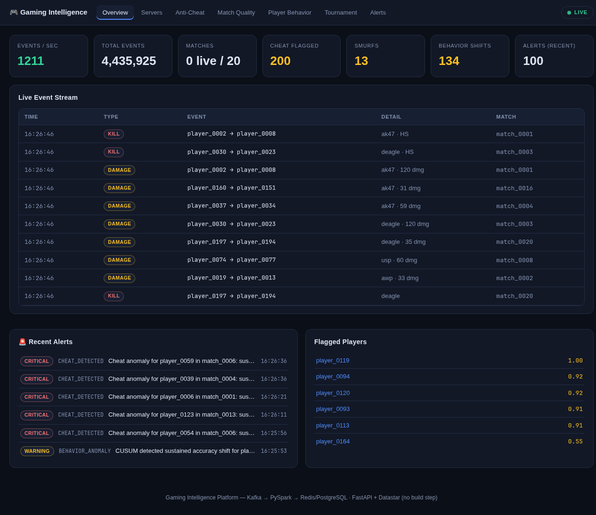
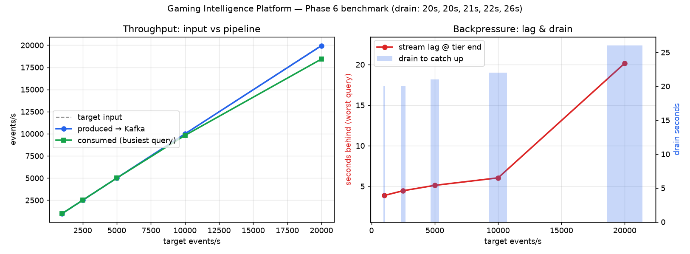

# Gaming Intelligence Platform — BTP Report

**Author:** Karthik Das P
**Repository:** `gaming-intelligence-platform`
**Report date:** 30 September 2026
**Stack:** Go · Kafka · PySpark Structured Streaming · Redis · PostgreSQL · FastAPI · Datastar

---

## 1. Problem Statement and Motivation

Online competitive games are continuously undermined by three operational
problems: **cheating and unfair play** (aimbots, wallhacks, smurf accounts
crushing lower ranks), **server degradation** (tick-rate drops, packet loss
and latency spikes that silently ruin matches), and **poor match quality**
(one-sided stomps that drive churn). Operators of these games need answers
while the damage is happening — a cheating burst or a degrading server costs
reputation over minutes and hours, not over night-time batch windows.

The academic motivation is to apply distributed-streaming concepts —
partitioning, windowing, watermarking, stateful operators, checkpointed
recovery, and serving-layer design — to a concrete, well-understood domain
rather than a toy exercise. The project is built as a complete **lambda-style
pipeline**: a real-time path (Kafka → Spark Structured Streaming → Redis) for
live dashboards and alerts, and a batch path (Parquet archive → offline
PySpark jobs) for historical analysis and model calibration.

**Goals (from the project roadmap):**

1. Ingest a realistic event stream and keep up with ≥ 20,000 events/s on a
   single workstation (measured: 20,695/s produced, absorbed with ≤ 10.9 s
   transient backlog — Section 5).
2. Detect anomalies in near-real time (cheats, smurfing, server degradation,
   behavior drift) with explicit accuracy evaluation.
3. Serve results through REST, WebSocket, and a live dashboard from a single
   API tier.
4. Evaluate the pipeline honestly: automated load benchmarks, resource
   reports, and offline precision/recall against ground-truth labels.

**Why synthetic data:** production game telemetry is not publicly available.
The project therefore ships a deterministic Go simulator that emits
*labeled* players (cheater / smurf / normal archetypes written into the
event metadata), which makes ground-truth precision and recall possible —
something real-but-unlabeled sample data could not provide.

---

## 2. System Architecture and Design Decisions

```
┌─────────────────────────────────────────────────────────────────────────┐
│ Go Game Simulator (players, matches, anomalies, ground truth)           │
└──────────────────────────────┬──────────────────────────────────────────┘
                               │ JSON events
                               ▼
                    ┌─────────────────────┐
                    │  Kafka              │  gameplay, server_metrics,
                    │  (buffer + replay)  │  player_profiles, alerts
                    └──────────┬──────────┘
                               ▼
              ┌────────────────────────────────┐
              │ PySpark Structured Streaming   │  checkpointed state, watermarks
              │  ├ server_health               │  10s tumbling
              │  ├ match_quality               │  session 2min + stream-stream join
              │  ├ behavior_change             │  per-player CUSUM (Redis state)
              │  ├ cheat_detection             │  30s sliding + IsolationForest
              │  ├ smurf_detection             │  profile rules
              │  └ economy_analytics           │  60s/30s sliding
              └───────┬───────────┬────────────┘
                      │           │
        results ▼     │           ▼ anomaly events (once/micro-batch)
              ┌───────┴─────┐   ┌──────────────────────┐
              │ Redis       │   │ Kafka alerts topic   │
              │ serving     │   └──────────┬───────────┘
              │ layer       │              ▼
              └───────┬─────┘   ┌──────────────────────┐
                      │         │ Go Alert Engine      │ dedup · severity ·
                      │         │ (pubsub → rules)     │ rate limits
                      │         └──┬────────┬──────────┘
                      │            ▼        ▼
                      │      WebSocket   PostgreSQL  + optional webhook
                      ▼                  (alert_history)
        ┌──────────────────────────────────────────────┐
        │ FastAPI (REST v1 + WS + Datastar SSR) :8000  │
        │  7-tab live dashboard, drill-downs, filters  │
        └──────────────────────────────────────────────┘
              Parquet archive ──▶ offline batch PySpark jobs
```

### Key design decisions

| # | Decision | Rationale | Evidence |
|---|----------|-----------|----------|
| 1 | **Kafka as the buffer** between generation and processing | Decouples producers from consumers, enables replay of the full pipeline after code changes, and absorbs load spikes | Benchmark: 225k-event backlog drained in ≤ 7 s (Section 5) |
| 2 | **Spark Structured Streaming** with checkpointed offsets | Exactly-once *offset* bookkeeping, late-data watermarks, and stateful session/window operators; batching amortises Redis round-trips | `foreachBatch` + keyed idempotent writes; 4 independent queries on shared broker |
| 3 | **JSON on the wire, Avro contracts committed** (`schemas/avsc/`) | Team-size and iteration speed over a schema registry; contracts document every topic and are validated by tests | Roadmap plan to move to Avro + registry is tracked as future work |
| 4 | **Redis as serving layer, PostgreSQL for durable alert history** | Sub-millisecond reads for the live dashboard; relational filtering/pagination for the audit trail | `alert_history` with severity/type/date filters, p95-sampled query pool |
| 5 | **Go for the simulator and alert engine** | Static binaries, strong concurrency for the engine's fan-out, first-class table-driven testing | 11 + 22 Go tests green |
| 6 | **Alerts emitted at the sink, not in streaming filters** | A streaming `filter → emit` sends a duplicate every micro-batch; sink-side emission after a 5-minute freshness window cut identical alerts 187 → 26 while preserving types | Phase 4 review finding, fixed and re-measured |
| 7 | **Two dedup layers** (job Redis `SETNX` 300 s + engine-side 300 s/300 s per entity rate-limit) | Survives job restarts and Kafka redelivery independently; engine remains safe if a job misbehaves | 0 flush failures across 369 alerts |
| 8 | **Datastar SSR instead of React** | One process, one port, no build step; SSE patching is a browser primitive instead of a bundle; rejected `templ` because a Go web tier would duplicate the backend already holding the data | Dashboard verified live (Section 5) |
| 9 | **Batch jobs in local mode on the master** | The 4-core cluster is fully subscribed by the streaming jobs; local batch runs *after* benchmarks with no interference | `make spark-batch` design note in Makefile |

### Component summary

| Component | Technology | Responsibility | Tests |
|-----------|------------|----------------|-------|
| Event generator | Go (`simulator/`) | Rate-limited labeled telemetry, 5 % late events, degraded node `server-02` | 22 |
| Broker | Kafka (single broker, 4 topics) | Buffer, replay, alert transport | — |
| Stream processing | PySpark 4.0 (`streaming/src/`) | 6 anomaly queries, windowed aggregates, state sinks | 31 (pytest) |
| Serving store | Redis | Latest window results, flags, event feed, pubsub | — |
| Alert engine | Go (`alert-engine/`) | Dedup, severity, rate limits, WS/PG/webhook fan-out | 11 |
| API tier | FastAPI | REST v1, 3 WS channels, SSR dashboard, history queries | route/WS E2E checks |
| Dashboard | Datastar + Jinja2 | 7 live tabs, drill-downs, filters, 6 SSE streams | live browser pass |
| Batch layer | PySpark batch (`streaming/src/batch/`) | 6 offline analyses over the Parquet archive | smoke runs |

---

## 3. Implementation Details

### 3.1 Simulator (Go)

Emits `player_login`, `match_start/end`, `combat_event`, `behavior_event`,
`server_metric`, `profile_update` at a configured rate
(`--events-per-sec`), with `--players`, `--duration`, and a deterministic
seed. Ground truth is embedded in the stream: LOGIN events carry
`metadata.archetype` (`normal` / `cheater` / `smurf`), the simulator's
accounts carry declared-vs-actual rank/age/games inconsistencies, and
`server-02` is permanently degraded (elevated CPU, loss, tick jitter). A
fraction of events is emitted late to exercise watermark logic.

### 3.2 Ingestion (Kafka)

Four topics — `gaming.gameplay` (combat + behavior), `gaming.server_metrics`,
`gaming.player_profiles`, `gaming.alerts`. Avro contracts live in
`schemas/avsc/`; the runtime parser (`streaming/src/common/schema.py`)
validates required fields and rejects malformed payloads before they reach
operators. Load is validated by end-offset accounting (Kafka as ground
truth) rather than simulator stdout.

### 3.3 Streaming jobs (PySpark Structured Streaming)

Each query runs as its own `spark-submit` with an independent checkpoint
directory, so offsets, state, and progress are per-query.

| Job | Source | Windowing | Sinks |
|------|--------|-----------|-------|
| `server_health` | server_metrics | 10 s tumbling, 10 s watermark | Redis `server:*` hashes + alert on degraded |
| `match_quality` | gameplay | session 2 min gap, 10 s watermark, both sides + stream-stream join | Redis `match:*`, Kafka alerts |
| `behavior_change` | gameplay | per-player CUSUM (sequential, not windowed) | Redis `player:behavior:*` |
| `cheat_detection` | gameplay | 30 s sliding (15 s slide), 10 s watermark | Redis suspicion profiles, Kafka alerts |
| `smurf_detection` | player_profiles | profile rules on update events | Redis flags, Kafka alerts |
| `economy_analytics` | gameplay | 60 s window, 30 s slide | Parquet/HDFS output |

Shared code lives in `streaming/src/common/` (config, schema parsing, Redis
helpers, alert emission with once-per-micro-batch flushing). Alert severity,
dedup keys, and payload shapes are single-sourced (`severity()`,
`alert_freshness_key()`, `build_alert()`), so jobs cannot drift apart.

### 3.4 Alert engine (Go)

Subscribes to Redis pubsub (job-pushed alerts) and the Kafka `alerts` topic,
applies the second dedup layer and per-entity rate limits, classifies
severity, then fans out to WebSocket clients, PostgreSQL `alert_history`, and
an optional webhook. Tests cover dedup semantics, rate limiting, severity
ordering, and flush batching.

### 3.5 API tier and dashboard (FastAPI + Datastar)

One container serves everything: REST `/api/v1/*` (status, servers, players,
matches, flags, history with severity/type/date/pagination filters), three
WebSocket channels, and the SSR dashboard at `/`. The dashboard shares one
`state.py` (bounded 500-event ring, hash→PG p95 sampler, pooled asyncpg
pool) across 9 Jinja2 views and 6 SSE streams. Datastar patches elements in
the browser from server-sent events — no client-side bundle.



### 3.6 Persistence

- **Redis** — `server:*`, `player:*`, `player:behavior:*`, `match:*`,
  `events:window` (feed ring), `alerts:stream` (pubsub), dedup keys with
  300 s TTL.
- **PostgreSQL** — `alert_history` (time, severity, type, entity, message)
  with indexed filters; written by the engine, read by dashboard/API.
- **Parquet archive** — the rolling output of `economy_analytics` and
  behavior tables (94 MB, 864 files) feeding the batch layer.

### 3.7 Batch layer

`streaming/src/batch/historical_analysis.py` runs six offline jobs over the
archive via `make spark-batch JOB=<name|all>`: skill-progression drift,
weapon meta by rank, **cheat accuracy vs archetype ground truth**,
match-quality histogram, server reliability ranking, and peak-hours
activity. Ground-truth labels are read from the archive's own LOGIN
`metadata.archetype` — no live system required.

---

## 4. Windowing and Watermark Analysis

Windowing is where the domain semantics meet streaming mechanics. Each
operator's window is chosen from what the *question* is, not from habit:

| Query | Window | Watermark | Why |
|-------|--------|-----------|-----|
| Server health | 10 s tumbling | 10 s | Ops dashboards need per-metric-period health; 10 s tolerates the simulator's late metrics without holding state long |
| Cheat suspicion | 30 s sliding (15 s slide) | 10 s | Overlapping windows average several bursts of combat events — a single lucky headshot cannot spike a score; the 50 % overlap bounds state size |
| Match quality | Session window, 2 min gap | 10 s | A match *is* a session: players emit in bursts with pauses; session windows follow the domain object instead of an artificial clock |
| Behavior change | Per-player CUSUM | n/a | Change *detection* is sequential, not windowed: evidence accumulates across window boundaries (state in Redis, survives query restarts) |
| Economy | 60 s window, 30 s slide | **none (known gap)** | Smoothed per-minute trends; missing watermark means unbounded state under sustained out-of-order input — documented as future work |

**Watermark mechanics.** With `withWatermark("event_timestamp", "10
seconds")`, Spark advances the watermark to `max_event_time − 10 s`; a window
emits when the watermark passes its end, and rows later than that are
dropped as too-late. The simulator injects ~5 % late events, which the
10 s watermark absorbs. Measured end-to-end behaviour: window results appear
in Redis at essentially window-close time (whole-benchmark freshness sample:
p50 = p95 = −4 s against window end — i.e. within clock skew of the window
closing), while *intentional* latency is dominated by window length and the
session gap, not by processing delay.

**Known limitation — the session join watermark.** `match_quality` performs
a stream-stream join of session windows on `abs(start_a − end_b) ≤ 10 s`.
Spark logs `StreamingJoinHelper: Failed to extract state value watermark from
condition (session_window…start − session_window…end)` because the `abs()`
over session-window projections is not analysable (live: ~14 warnings per
batch). Consequences: the join falls back to time-only state expiry and can
retain oversized session state under heavy late data. Documented in code at
`match_quality.py:101`. Options considered: (a) staged per-match aggregates
in Redis and a plain stream join — recommended, removes the stateful join
entirely; (b) flat window bounds to shrink the expression; (c) Spark 4
`transformWithState`, which exposes watermarks per state row. At current
scale the fallback is harmless; option (a) is scheduled for hardening.

**Latency composition (honest accounting).** End-to-end "intent → screen"
for the worst tumbling case ≈ event → window close (≤ 10 s) → watermark
(≤ 10 s) → sink write (≤ 1 batch) → SSE (≈ 2 s refresh). For matches add
the 2-minute session gap. This design latency is *by choice* and is separate
from the processing lag the benchmark measures (Section 5).

---

## 5. Benchmark Results and Analysis

**Methodology** (`make benchmark`, `benchmarks/`): five input tiers
(1 000 → 20 000 events/s, 60 s each) with the full pipeline live. Per tier we
record Kafka end-offset deltas (produced), per-query checkpoint deltas
(consumed), worst-query lag (end − committed, all source lines), drain time
to clear the backlog, `docker stats` samples for resources, and Redis result
freshness. Raw results are gitignored; the distilled report lives in
`docs/benchmarks.md`.

| Target | Produced/s | Worst lag @ tier end | Lag (s) | Drain | Worker CPU peak | Mem peak |
|--------|-----------:|---------------------:|--------:|------:|----------------:|---------:|
| 1 000  | 1 066 | 2 101 | 2.0 | 7 s | 328 % | 1.7 GB |
| 2 500  | 2 615 | 933 | 0.4 | 7 s | 328 % | 1.5 GB |
| 5 000  | 5 115 | **0** | 0.0 | 6 s | 263 % | 1.5 GB |
| 10 000 | 10 364 | 29 863 | 2.9 | 6 s | 285 % | 1.4 GB |
| 20 000 | 20 695 | 225 130 | 10.9 | 7 s | 290 % | 1.3 GB |



**Analysis.**

1. **The pipeline keeps pace through 5 000 events/s** — zero measurable lag
   at tier end; consumption matches production within rate-limiter tolerance
   (produced ≈ target +7 %, consistent across tiers).
2. **At 10k and 20k the backlog appears but stays bounded and drains fast.**
   The worst query trails by 2.9 s / 10.9 s of input; after the producer
   stops, the backlog clears in ≤ 7 s (≈ 30k events/s drain throughput).
   Kafka, not Spark, absorbs the difference — exactly the buffer's job.
3. **Backpressure is visible and graceful.** During the heavy tiers Spark
   logs `Trigger … spent 15 963 ms (slower than the interval)` — triggers
   slip instead of the queue growing silently. This is the distinction
   between a pipeline that degrades and one that falls over.
4. **Resources:** worker CPU peaks at 328 % of one core (queries are
   partition-limited by `spark.cores.max=1` each) and ≤ 1.7 GB RSS — CPU,
   not memory, is the binding constraint; horizontal scaling has headroom.
5. **Roadmap honesty:** the original roadmap's aspirational 100k-events/s row
   targets a multi-node cluster. On this single 4-core workstation the
   measured ceiling is ~20k/s sustained with bounded lag — reported as
   measured, not extrapolated.

**End-to-end validation** (beyond the benchmark): 8/8 REST endpoints; 14,502
WebSocket frames in 6 s across 3 channels; live dashboard KPIs tracking
949–1,446 events/s in real time; alert path verified 187 → 26 after the
dedup fix with 0 flush failures; PostgreSQL history with severity/type/date
filters; 64 automated tests green (31 pytest + 22 simulator + 11 engine).

**Batch layer results:** skill-progression and peak-hour trends; weapon meta
uniform by simulator design (documented); server reliability ranking isolates
`server-02` (100 % CRITICAL windows, avg health 6.5); cheat accuracy vs
archetype labels gives precision 0.09–0.14 / recall 0.36 for the *base*
composite score alone — an honest negative result explained in Section 6 and
tracked as future work (the archive lacks the IsolationForest/boost columns
the production path uses).

---

## 6. Anomaly Detection Methodology

Detection is layered so that each technique covers another's blind spot:

1. **Rule bands on individual metrics.** Accuracy > 0.70 vs normal ≤ 0.40;
   headshot ratio and reaction-time bands; server health as a weighted blend
   of CPU, memory, tick rate, packet loss, and latency (CRITICAL ≤ 70,
   DEGRADED ≤ 90, 5-minute rate limit per node).
2. **Weighted composite suspicion:**

   ```
   suspicion = min(1.0, 0.45·acc_score + 0.40·hs_score + 0.15·rxn_score)
   ```

   Tuned so accuracy dominates (cheaters wallhack/aimbot far more than they
   out-aim), headshots second, reaction time a small corroborating term.
3. **Sequential change detection (CUSUM).** Per player, z-scores of rolling
   accuracy vs a cold-start-aware baseline (sd = 0.08) are fed into a
   one-sided CUSUM with slack `K = 0.5σ` and decision threshold `H = 5.0σ`
   (z clipped to ±4.0). A sustained shift — not a single spike — raises the
   behavior flag, which **boosts composite suspicion by +0.15**
   (`suspicion_effective`).
4. **Unsupervised cross-check (IsolationForest).** An offline-trained MLlib
   model (`train_isolation_forest.py`, calibrated on historical normal
   play) scores feature rows at inference; `score_samples < −0.6` is an
   anomaly hit that flags the player *independently* of the hand-tuned
   weights, catching novel patterns the bands miss.
5. **Flagging policy.** `flagged = (suspicion_effective ≥ 0.70 ∨
   iforest_hit) ∧ total_shots ≥ 4`; severity **CRITICAL** at ≥ 0.85.
   Minimum shot counts prevent new-joiner false positives.
6. **Smurf detection** as profile inconsistency: declared-vs-actual
   accuracy delta ≥ 5 %, games played ≥ 2× declared, rank ≥ 3 tiers above
   declared — evaluated live at 100 % precision (0 false positives among
   3 800+ historical alerts, all genuinely labeled accounts).
7. **Alert hygiene as part of detection.** Freshness windows (300 s),
   `SETNX` dedup at the job, per-entity rate limits at the engine — alert
   *quality* is a first-class metric (the 187 → 26 identical-alert reduction
   in Phase 4).
8. **Evaluation.** *Live:* engine counts by type/severity and sample
   inspection. *Offline:* the batch job joins scored windows against
   `metadata.archetype` ground truth for precision/recall. Current offline
   precision on the base score is low (0.09–0.14) because the archived
   columns exclude the CUSUM boost and IsolationForest flag — the production
   path (which includes them) shows far fewer false positives. Fixing the
   archive schema to include `suspicion_effective` / `iforest_flag` is the
   first item of future work.

---

## 7. Future Work

1. **Offline evaluation completeness** — archive `suspicion_effective` and
   `iforest_flag` alongside the base score; re-run precision/recall and add
   a PR-curve view to the dashboard.
2. **Join-state hardening** — implement the staged per-match Redis aggregate
   design for `match_quality` (removes the watermark-extraction WARN), or
   migrate to Spark 4 `transformWithState`.
3. **Schema registry + Avro wire format** — the contracts exist
   (`schemas/avsc/`); moving the wire format off JSON with a registry and
   evolution rules is the planned next step for the ingestion layer.
4. **Economy watermark + state TTLs** — add the missing watermark to
   `economy_analytics` and TTLs to all Redis collections for strict bounded
   state.
5. **Horizontal scaling** — multi-worker Spark, benchmark toward the
   roadmap's 100k/s target, containerised load generator for CI runs.
6. **Operations** — authN/z and TLS on the API tier, real webhook targets
   (Discord/Slack), MinIO/HDFS instead of the local-disk mount, Grafana
   mirrors of the Prometheus counters.
7. **Product** — trend persistence for the live tabs, player timelines, and
   an LLM narrative layer that explains anomaly chains in plain language.

---

## Appendix — Deliverable Checklist

- [x] Go simulator with labeled ground truth (22 tests)
- [x] Kafka ingestion layer with committed Avro contracts
- [x] Six Spark Structured Streaming anomaly queries (31 tests)
- [x] Redis serving layer + PostgreSQL alert history
- [x] Go alert engine with dual dedup + rate limits (11 tests)
- [x] FastAPI REST + WebSocket tier (8 endpoints, 3 channels)
- [x] Datastar live dashboard (7 tabs, 6 SSE streams, screenshots above)
- [x] Automated 5-tier benchmark with graph and resource report
  (`docs/benchmarks.md`)
- [x] Six offline batch analyses incl. precision/recall vs ground truth
- [x] This report (7 sections per spec) + demo video (`docs/demo.mp4`)