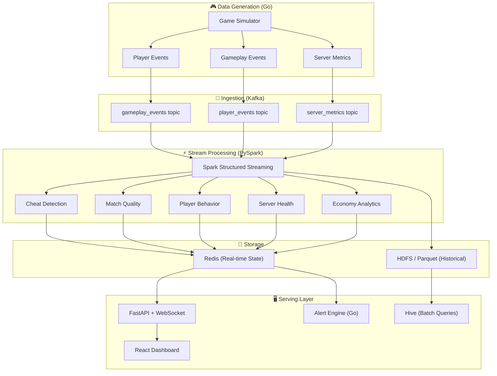
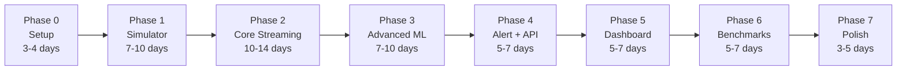

# 🎮 Real-Time Competitive Gaming Intelligence Platform — Project Roadmap

---

## Language Decision Matrix

Before diving into phases, here's the language breakdown per component:

| Component                        | Recommended Language             | Why                                                                                                                                                                                                             |
| -------------------------------- | -------------------------------- | --------------------------------------------------------------------------------------------------------------------------------------------------------------------------------------------------------------- |
| **Game Event Simulator**         | **Go**                           | High-throughput, lightweight goroutines for simulating thousands of concurrent players. Compiles to a single binary. Native Kafka producer libraries (`confluent-kafka-go`/`segmentio/kafka-go`) are excellent. |
| **Spark Streaming Pipelines**    | **Python (PySpark)**             | First-class Spark support. Faster iteration. MLlib integration for anomaly detection. Your BTP evaluators read Python. Scala is the only real alternative here — but Python wins for prototyping speed.         |
| **Dashboard / API**              | **Python (FastAPI + WebSocket)** | FastAPI for REST, WebSocket for live push. Integrates directly with your Spark output (Parquet, Redis, Postgres).                                                                                               |
| **Frontend Dashboard**           | **React + TypeScript**           | Real-time charts via Recharts/D3. WebSocket integration. Looks impressive in demos.                                                                                                                             |
| **Alert Engine**                 | **Go**                           | Lightweight consumer that reads Kafka alert topics and fires webhooks/notifications. Go's concurrency model is perfect for this.                                                                                |
| **Benchmarking / Load Testing**  | **Go**                           | You need raw throughput control. Go lets you dial events/sec precisely with rate limiters.                                                                                                                      |
| **Historical Batch Analysis**    | **Python (PySpark)**             | Same PySpark codebase, just batch mode on HDFS/Hive.                                                                                                                                                            |
| **Data Schemas / Serialization** | **Protobuf or Avro**             | Language-agnostic. Both Go and Python have codegen. Avro has native Kafka Schema Registry support.                                                                                                              |

> **TIP:** The winning combo is Go + Python (PySpark) + React/TS. Go handles the high-performance data generation and lightweight services. Python handles all Spark processing and ML. React handles visualization. You avoid Java entirely.

### Why Go over Python for the simulator?

```text
Python simulator          Go simulator
─────────────────         ──────────────
~5,000 events/sec         ~200,000+ events/sec
GIL bottleneck            True concurrency
asyncio complexity        Goroutines (simple)
Heavy memory              Lightweight
```

You _can_ write a Python simulator for initial prototyping (Phase 1), but you'll hit a wall when you need 50K+ events/sec. Switch to Go for the production simulator.

---

## Architecture Overview



---

## Phase 0: Foundation & Environment Setup

**Duration: 3–4 days**

### Goals

- Set up the full development environment
- Get Kafka + Spark running locally
- Establish project structure and schemas

### Tasks

| #   | Task                       | Details                                                                       |
| --- | -------------------------- | ----------------------------------------------------------------------------- |
| 0.1 | **Docker Compose stack**   | Kafka (KRaft mode, no Zookeeper), Spark master + 2 workers, Redis, PostgreSQL |
| 0.2 | **Define event schemas**   | Use Avro or Protobuf. Define schemas for all event types (see below)          |
| 0.3 | **Create Kafka topics**    | `gameplay_events`, `player_events`, `server_metrics`, `alerts`                |
| 0.4 | **Project repo structure** | See recommended structure below                                               |
| 0.5 | **Verify Spark ↔ Kafka**   | Write a trivial PySpark consumer that reads from Kafka and prints to console  |
| 0.6 | **Set up CI**              | Linting, basic tests, Docker build                                            |

### Event Schemas (Avro recommended)

```json
// gameplay_event.avsc
{
  "type": "record",
  "name": "GameplayEvent",
  "fields": [
    { "name": "event_id", "type": "string" },
    {
      "name": "event_type",
      "type": {
        "type": "enum",
        "name": "EventType",
        "symbols": [
          "KILL",
          "DEATH",
          "DAMAGE",
          "HEADSHOT",
          "ABILITY_USE",
          "ITEM_PURCHASE",
          "MOVEMENT",
          "SHOT_FIRED"
        ]
      }
    },
    { "name": "match_id", "type": "string" },
    { "name": "player_id", "type": "string" },
    { "name": "target_player_id", "type": ["null", "string"] },
    { "name": "weapon_id", "type": ["null", "string"] },
    { "name": "damage", "type": ["null", "float"] },
    { "name": "position_x", "type": "float" },
    { "name": "position_y", "type": "float" },
    { "name": "position_z", "type": "float" },
    { "name": "accuracy", "type": ["null", "float"] },
    { "name": "distance", "type": ["null", "float"] },
    { "name": "reaction_time_ms", "type": ["null", "int"] },
    { "name": "is_headshot", "type": "boolean", "default": false },
    { "name": "event_time", "type": "long", "logicalType": "timestamp-millis" },
    { "name": "server_id", "type": "string" }
  ]
}
```

```json
// server_metric.avsc
{
  "type": "record",
  "name": "ServerMetric",
  "fields": [
    { "name": "server_id", "type": "string" },
    { "name": "region", "type": "string" },
    { "name": "cpu_percent", "type": "float" },
    { "name": "ram_percent", "type": "float" },
    { "name": "tick_rate", "type": "int" },
    { "name": "packet_loss_percent", "type": "float" },
    { "name": "avg_latency_ms", "type": "float" },
    { "name": "active_players", "type": "int" },
    { "name": "active_matches", "type": "int" },
    { "name": "timestamp", "type": "long", "logicalType": "timestamp-millis" }
  ]
}
```

```json
// player_event.avsc
{
  "type": "record",
  "name": "PlayerEvent",
  "fields": [
    { "name": "player_id", "type": "string" },
    {
      "name": "event_type",
      "type": {
        "type": "enum",
        "name": "PlayerEventType",
        "symbols": [
          "LOGIN",
          "LOGOUT",
          "MATCHMAKING_START",
          "MATCHMAKING_FOUND",
          "MATCH_JOIN",
          "MATCH_LEAVE",
          "DISCONNECT",
          "RECONNECT",
          "REPORT_PLAYER",
          "CHAT_MESSAGE"
        ]
      }
    },
    { "name": "match_id", "type": ["null", "string"] },
    {
      "name": "metadata",
      "type": ["null", { "type": "map", "values": "string" }]
    },
    { "name": "event_time", "type": "long", "logicalType": "timestamp-millis" },
    { "name": "server_id", "type": ["null", "string"] }
  ]
}
```

### Recommended Repo Structure

```text
gaming-intelligence-platform/
├── docker-compose.yml
├── README.md
├── schemas/                          # Avro/Protobuf schemas
│   ├── gameplay_event.avsc
│   ├── player_event.avsc
│   └── server_metric.avsc
├── simulator/                        # Go
│   ├── go.mod
│   ├── cmd/
│   │   └── simulator/main.go
│   ├── internal/
│   │   ├── player/                   # Player behavior models
│   │   ├── match/                    # Match simulation engine
│   │   ├── server/                   # Server metric generation
│   │   ├── producer/                 # Kafka producer
│   │   └── config/
│   └── profiles/                     # Player behavior profiles (JSON/YAML)
│       ├── normal.yaml
│       ├── cheater_aimbot.yaml
│       ├── cheater_wallhack.yaml
│       ├── smurf.yaml
│       └── toxic.yaml
├── streaming/                        # PySpark
│   ├── requirements.txt
│   ├── src/
│   │   ├── jobs/
│   │   │   ├── cheat_detection.py
│   │   │   ├── match_quality.py
│   │   │   ├── player_behavior.py
│   │   │   ├── server_health.py
│   │   │   ├── smurf_detection.py
│   │   │   └── economy_analytics.py
│   │   ├── common/
│   │   │   ├── schemas.py
│   │   │   ├── windows.py
│   │   │   └── sinks.py
│   │   └── ml/
│   │       ├── anomaly_model.py
│   │       └── features.py
│   └── tests/
├── alert-engine/                     # Go
│   ├── go.mod
│   └── cmd/alert-engine/main.go
├── api/                              # Python FastAPI
│   ├── requirements.txt
│   ├── main.py
│   ├── routers/
│   └── ws/                           # WebSocket handlers
├── dashboard/                        # React + TypeScript
│   ├── package.json
│   └── src/
├── batch/                            # PySpark batch jobs
│   └── historical_analysis.py
├── benchmarks/                       # Go
│   ├── throughput_test.go
│   └── results/
└── docs/
    ├── ROADMAP.md
    ├── architecture.md
    └── benchmarks.md
```

---

## Phase 1: Game Event Simulator (The Data Engine)

**Duration: 7–10 days**

> **IMPORTANT:** This is the most critical phase. Every downstream component depends on realistic, configurable data. Spend time here.

### Goals

- Build a simulator that generates realistic competitive FPS game events
- Support configurable player archetypes (normal, cheater, smurf, etc.)
- Publish to Kafka at controllable throughput

### Where does the data come from?

You're **generating it**, not sourcing it. This is the right approach because:

1. **No public competitive game datasets exist** at the event-stream granularity you need (per-shot, per-movement)
2. Real game data is proprietary (Riot, Valve, Blizzard won't share raw event streams)
3. A simulator gives you **control** — you can inject cheaters, smurfs, server failures on demand
4. The simulator itself is a deliverable that demonstrates systems thinking

### Data Generation Strategy

#### Step 1: Define Player Behavior Profiles

```yaml
# profiles/normal.yaml
name: "Normal Player"
skill_tier: "gold"
accuracy:
  mean: 0.28
  std: 0.08
headshot_ratio:
  mean: 0.12
  std: 0.04
reaction_time_ms:
  mean: 280
  std: 60
kills_per_minute:
  mean: 0.8
  std: 0.3
movement:
  pattern: "natural" # random walk with objectives
  speed_variance: 0.15
deaths_per_minute:
  mean: 0.6
  std: 0.2
```

```yaml
# profiles/cheater_aimbot.yaml
name: "Aimbot Cheater"
skill_tier: "silver" # Actual account rank (low)
accuracy:
  mean: 0.92 # Abnormally high
  std: 0.03
headshot_ratio:
  mean: 0.88 # Almost all headshots
  std: 0.05
reaction_time_ms:
  mean: 85 # Inhuman
  std: 10
kills_per_minute:
  mean: 4.5
  std: 0.8
movement:
  pattern: "natural" # Movement might still be normal
  speed_variance: 0.15
```

```yaml
# profiles/smurf.yaml
name: "Smurf"
skill_tier: "bronze" # New/low-rank account
account_age_days: 3
games_played: 12
accuracy:
  mean: 0.65 # Very high for "bronze"
  std: 0.05
headshot_ratio:
  mean: 0.35
  std: 0.05
reaction_time_ms:
  mean: 160 # Way too fast for bronze
  std: 25
win_rate: 0.92 # Dominates the lobby
```

#### Step 2: Match Simulation Engine (Go)

```text
Match Simulator
      │
      ├── Create match (10 players, 2 teams)
      ├── Assign players from pool (90% normal, 5% smurf, 3% cheater, 2% toxic)
      ├── Simulate rounds/ticks
      │     ├── Each tick (100ms game time):
      │     │     ├── Player movements (based on profile)
      │     │     ├── Engagements (proximity → combat)
      │     │     ├── Shots fired (accuracy from profile)
      │     │     ├── Kills/deaths (damage model)
      │     │     ├── Item purchases (economy model)
      │     │     └── Ability usage
      │     └── Emit events to Kafka
      ├── Match end → summary events
      └── Server metrics every 1 second
```

#### Step 3: Calibrate with Real-World Stats

Use publicly available aggregate statistics to calibrate your distributions:

| Source                                       | What you get                                                         | URL                                 |
| -------------------------------------------- | -------------------------------------------------------------------- | ----------------------------------- |
| **CS2 / CSGO stats** (Leetify, csgostats.gg) | Accuracy, headshot %, K/D distributions by rank                      | Public leaderboards                 |
| **Valorant (tracker.gg)**                    | K/D, win rates, accuracy by rank                                     | tracker.gg API                      |
| **Kaggle CS:GO datasets**                    | Round-level match data (not per-event, but useful for distributions) | `kaggle.com/datasets` search "csgo" |
| **HLTV**                                     | Pro player stats for calibrating "elite" profiles                    | hltv.org                            |
| **OpenDota API**                             | MOBA-style match data (useful for economy/item patterns)             | api.opendota.com                    |

> **NOTE:** You don't use these datasets directly in your pipeline. You use them to **calibrate your simulator's probability distributions** so the generated data is realistic. In your report, you cite these sources and show how your simulator's output distributions match real-world ones.

#### Step 4: Go Simulator Architecture

```text
main.go
   │
   ├── --players 10000
   ├── --matches-concurrent 500
   ├── --events-per-sec 50000       # Rate limiter
   ├── --cheater-ratio 0.03
   ├── --smurf-ratio 0.05
   ├── --server-count 50
   ├── --kafka-brokers localhost:9092
   ├── --duration 30m
   └── --late-event-ratio 0.05      # % of events with artificial delay (for watermark testing)
```

Key Go packages to use:

- `github.com/segmentio/kafka-go` or `github.com/confluentinc/confluent-kafka-go` — Kafka producer
- `github.com/linkedin/goavro/v2` — Avro serialization
- `golang.org/x/time/rate` — Rate limiting
- `math/rand/v2` — Statistical distributions

### Deliverables

- [ ] Go simulator binary with CLI flags
- [ ] 5+ player behavior profiles (YAML)
- [ ] Kafka producer with batching and compression
- [ ] Rate limiter for controlled throughput
- [ ] Late-event injection for watermark testing
- [ ] Basic integration test: simulator → Kafka → console consumer

---

## Phase 2: Core Streaming Pipeline (Spark Structured Streaming)

**Duration: 10–14 days**

### Goals

- Build 3 core streaming jobs in PySpark
- Implement proper windowing (tumbling, sliding, session)
- Handle event-time vs processing-time
- Write results to Redis + HDFS/Parquet

### Job 1: Server Health Monitor (Start here — simplest)

```python
# streaming/src/jobs/server_health.py

from pyspark.sql import SparkSession
from pyspark.sql.functions import *
from pyspark.sql.types import *

spark = SparkSession.builder \
    .appName("ServerHealthMonitor") \
    .getOrCreate()

# Read from Kafka
server_stream = spark.readStream \
    .format("kafka") \
    .option("kafka.bootstrap.servers", "localhost:9092") \
    .option("subscribe", "server_metrics") \
    .load()

# Parse Avro (or JSON for simplicity initially)
parsed = server_stream \
    .select(from_json(col("value").cast("string"), schema).alias("data")) \
    .select("data.*")

# 10-second tumbling window
health_scores = parsed \
    .withWatermark("timestamp", "5 seconds") \
    .groupBy(
        window("timestamp", "10 seconds"),
        "server_id",
        "region"
    ) \
    .agg(
        avg("cpu_percent").alias("avg_cpu"),
        avg("ram_percent").alias("avg_ram"),
        avg("tick_rate").alias("avg_tick_rate"),
        avg("packet_loss_percent").alias("avg_packet_loss"),
        avg("avg_latency_ms").alias("avg_latency"),
        max("active_players").alias("peak_players"),
        # Health score: weighted composite
        (
            100
            - (avg("cpu_percent") * 0.2)
            - (avg("packet_loss_percent") * 3)
            - (greatest(lit(0), lit(128) - avg("tick_rate")) * 2)
            - (greatest(lit(0), avg("avg_latency_ms") - lit(50)) * 0.5)
        ).alias("health_score")
    )

# Alert on degraded servers
alerts = health_scores.filter(col("health_score") < 50)
```

### Job 2: Cheat Detection (The flagship job)

```text
Input: gameplay_events topic

Pipeline:
  1. Parse events
  2. Filter to combat events (KILL, SHOT_FIRED, HEADSHOT, DAMAGE)
  3. Group by player_id + sliding window (30 sec slide, 5 min window)
  4. Compute feature vector:
       - kills_per_minute
       - headshot_ratio
       - accuracy
       - avg_reaction_time_ms
       - avg_target_distance
       - damage_per_minute
       - movement_entropy (how "robotic" is the movement)
  5. Compute anomaly score using z-scores against population stats
  6. Flag players with anomaly_score > threshold
  7. Write to Redis (live state) + Kafka alerts topic + HDFS (audit trail)
```

**Windowing strategy:**

```text
┌──────────────────────────────────────────────┐
│          Sliding Window: 5 minutes           │
│          Slide interval: 30 seconds          │
│                                              │
│  ┌─────────┐                                 │
│  │ Latest  │  ← Most recent 30-sec slice     │
│  │ slice   │     recalculates the full        │
│  └─────────┘     5-minute feature vector      │
│                                              │
│  Watermark: 10 seconds                       │
│  (accept events up to 10 sec late)           │
└──────────────────────────────────────────────┘
```

### Job 3: Match Quality Scoring

```text
Input: gameplay_events + player_events

Pipeline:
  1. Join streams on match_id
  2. Session window per match (gap = 2 minutes → match likely ended)
  3. Compute per-match:
       - skill_imbalance = |avg_mmr_team_a - avg_mmr_team_b|
       - kill_distribution_entropy (are kills spread or one-sided?)
       - disconnect_count
       - avg_latency_variance
       - match_duration (too short = stomp)
       - surrender (if applicable)
  4. Composite match_quality_score (0-100)
  5. Write to Redis + HDFS
```

### Windowing & Watermark Deep-Dive

| Concept                   | What you implement                              | Why it matters                                  |
| ------------------------- | ----------------------------------------------- | ----------------------------------------------- |
| **Tumbling window**       | Server health (10-sec windows)                  | Non-overlapping, simple aggregation             |
| **Sliding window**        | Cheat detection (5 min window, 30 sec slide)    | Overlapping, catches patterns across boundaries |
| **Session window**        | Match quality (gap-based)                       | Groups events belonging to one match            |
| **Watermark**             | All jobs (5–30 sec depending on job)            | Handles late events from network delays         |
| **Event-time processing** | All jobs use event timestamps, not arrival time | Core streaming concept                          |

### Output Sinks

| Sink                       | Purpose                           | Library                                 |
| -------------------------- | --------------------------------- | --------------------------------------- |
| **Redis**                  | Real-time state (live dashboards) | `redis-py`, use `foreachBatch` in Spark |
| **HDFS / Parquet**         | Historical analysis, audit trail  | Native Spark Parquet writer             |
| **Kafka (`alerts` topic)** | Feed the alert engine             | Spark Kafka sink                        |
| **Console**                | Development/debugging             | Spark console sink                      |

### Deliverables

- [ ] Server health streaming job with tumbling windows
- [ ] Cheat detection job with sliding windows + anomaly scoring
- [ ] Match quality job with session windows
- [ ] Watermark handling demonstrated (inject late events from simulator)
- [ ] Redis sink for real-time state
- [ ] Parquet sink for historical data
- [ ] Unit tests for feature computation logic

---

## Phase 3: Advanced Analytics & ML

**Duration: 7–10 days**

### Goals

- Add smurf detection
- Add player behavior profiling
- Add economy analytics
- Introduce a simple ML anomaly model

### Smurf Detection

```text
Trigger: player_events (new account detected)

Features:
  - account_age_days
  - games_played
  - current_rank
  - avg_accuracy (from gameplay_events, last N games)
  - avg_kd_ratio
  - win_rate
  - avg_reaction_time

Logic:
  if account_age < 14 days AND games_played < 30:
    compute skill_score from features
    compare against expected skill_distribution[current_rank]
    smurf_probability = 1 - cdf(skill_score, rank_distribution)
    if smurf_probability > 0.85:
      FLAG
```

### Player Behavior Change Detection

Use **CUSUM (Cumulative Sum)** or simple **rolling z-score** to detect sudden behavioral shifts:

```text
Player 821
               rolling average K/D
                    │
    ────────────────┤
                    │    ← sudden spike
                    │  ╱
                    │╱
                    ┼─────────────────

    Normal: 2.8     Anomaly: 9.2

    z-score = (9.2 - 2.8) / 0.5 = 12.8
    → BEHAVIORAL ANOMALY
```

### ML Anomaly Detection (Spark MLlib)

Train an Isolation Forest or use statistical z-score approach:

```python
# Use Spark MLlib's StandardScaler + manual z-score
# Or use sklearn in foreachBatch for Isolation Forest

from sklearn.ensemble import IsolationForest

def detect_anomalies(batch_df, batch_id):
    pdf = batch_df.toPandas()
    features = pdf[['accuracy', 'headshot_ratio', 'reaction_time_ms',
                     'kills_per_min', 'damage_per_min']].values

    model = IsolationForest(contamination=0.05)
    pdf['anomaly'] = model.fit_predict(features)
    # anomaly = -1 means outlier

    flagged = pdf[pdf['anomaly'] == -1]
    # Write flagged players to Redis/alerts
```

> **NOTE:** For a BTP, using `foreachBatch` with sklearn is perfectly acceptable. You're demonstrating that you understand how to integrate ML into a streaming pipeline. You don't need a production-grade online learning system.

### Deliverables

- [ ] Smurf detection streaming job
- [ ] Player behavior change detection (CUSUM or rolling z-score)
- [ ] Economy analytics (weapon popularity, item purchase patterns)
- [ ] Anomaly detection using Isolation Forest in `foreachBatch`
- [ ] Cross-job data flow (behavior anomaly → feeds cheat detection)

---

## Phase 4: Alert Engine & API Layer

**Duration: 5–7 days**

### Goals

- Build a Go alert engine that consumes the `alerts` Kafka topic
- Build a FastAPI backend serving real-time data from Redis
- WebSocket support for live dashboard updates

### Alert Engine (Go)

```text
Kafka alerts topic
        │
        ▼
  Go Alert Consumer
        │
        ├── Dedup (Redis-backed, avoid duplicate alerts)
        ├── Severity classification (INFO / WARNING / CRITICAL)
        ├── Rate limiting (max 1 alert per player per 5 min)
        │
        ├──→ Webhook (Discord / Slack)
        ├──→ Write to PostgreSQL (alert history)
        └──→ Push to WebSocket (dashboard)
```

### FastAPI Endpoints

```text
GET  /api/v1/servers                    # All server health scores
GET  /api/v1/servers/{id}/health        # Single server health timeline
GET  /api/v1/matches/active             # Currently active matches
GET  /api/v1/matches/{id}/quality       # Match quality score + breakdown
GET  /api/v1/players/{id}/profile       # Live player profile
GET  /api/v1/players/{id}/suspicion     # Cheat suspicion score
GET  /api/v1/players/flagged            # All flagged players
GET  /api/v1/alerts/recent              # Recent alerts
GET  /api/v1/tournament/live            # Live tournament stats
WS   /ws/live                           # WebSocket: real-time event feed
WS   /ws/alerts                         # WebSocket: live alert stream
GET  /api/v1/stats/throughput           # Pipeline throughput metrics
```

### Deliverables

- [ ] Go alert engine with Kafka consumer + dedup + rate limiting
- [ ] FastAPI backend with Redis integration
- [ ] WebSocket endpoints for live data
- [ ] API documentation (auto-generated by FastAPI)

---

## Phase 5: Dashboard & Visualization

**Duration: 5–7 days**

### Goals

- Build a React dashboard with real-time updates
- Multiple views: overview, server health, anti-cheat, match quality, tournament

### Dashboard Screens

```text
┌────────────────────────────────────────────────────────┐
│  🎮 GAMING INTELLIGENCE PLATFORM                       │
├──────┬──────┬──────┬──────┬──────┬──────┬─────────────┤
│ Over │ Serv │ Anti │Match │Plyr  │Tourn │ Alerts      │
│ view │ ers  │Cheat │Qual  │Behav │ament │             │
├──────┴──────┴──────┴──────┴──────┴──────┴─────────────┤
│                                                        │
│  ┌──────────────┐  ┌──────────────┐  ┌──────────────┐ │
│  │ Events/sec   │  │ Active       │  │ Players      │ │
│  │   48,291     │  │ Matches: 412 │  │ Online: 8.2K │ │
│  └──────────────┘  └──────────────┘  └──────────────┘ │
│                                                        │
│  ┌──────────────────────────────────────────────────┐  │
│  │          Live Event Stream (scrolling)           │  │
│  │  10:01:05  KILL   Player_182 → Player_441  AK47 │  │
│  │  10:01:05  DMAGE  Player_091 → Player_332   120 │  │
│  │  10:01:06  HDSHOT Player_182 → Player_092  AWP  │  │
│  └──────────────────────────────────────────────────┘  │
│                                                        │
│  ┌─────────────────────┐  ┌─────────────────────────┐  │
│  │ 🚨 Recent Alerts    │  │ Flagged Players          │  │
│  │ Server 21 DEGRADED  │  │ Player_1827  Score: 0.94 │  │
│  │ Player_1827 FLAGGED │  │ Player_4421  Score: 0.87 │  │
│  └─────────────────────┘  └─────────────────────────┘  │
└────────────────────────────────────────────────────────┘
```

### Key Libraries

- **Recharts** or **Tremor** — Charts
- **TanStack Table** — Data tables
- **React Query** — API data fetching
- **Socket.io-client** or native WebSocket — Real-time updates

### Deliverables

- [ ] Overview dashboard with key metrics
- [ ] Server health map with live indicators
- [ ] Anti-cheat view with flagged players + suspicion scores
- [ ] Match quality histogram + individual match drill-down
- [ ] Live event stream display
- [ ] Alert feed

---

## Phase 6: Benchmarking & Historical Analysis

**Duration: 5–7 days**

### Goals

- Benchmark the pipeline at various throughput levels
- Build batch analysis jobs on historical data
- Generate performance report

### Benchmarking

Use the Go simulator with increasing `--events-per-sec`:

```text
┌──────────────┬─────────────┬──────────────┬─────────────┐
│ Events/sec   │ Spark       │ 95th %ile    │ Kafka       │
│ (input)      │ Throughput  │ Latency (ms) │ Lag         │
├──────────────┼─────────────┼──────────────┼─────────────┤
│ 1,000        │ 1,000       │ 120          │ 0           │
│ 5,000        │ 5,000       │ 150          │ 0           │
│ 10,000       │ 10,000      │ 210          │ ~50         │
│ 25,000       │ 24,800      │ 380          │ ~200        │
│ 50,000       │ 48,500      │ 520          │ ~1,500      │
│ 100,000      │ 82,000      │ 1,200        │ ~18,000     │
└──────────────┴─────────────┴──────────────┴─────────────┘
```

Measure:

- **Throughput**: events processed per second
- **Latency**: event-time to result-time (p50, p95, p99)
- **Kafka consumer lag**: how far behind is Spark
- **Resource usage**: CPU, memory per Spark executor
- **Backpressure behavior**: what happens when Spark can't keep up

### Historical Batch Analysis (PySpark Batch Mode)

```text
HDFS Parquet files (accumulated from streaming)
        │
        ▼
PySpark Batch Job
        │
        ├── Player skill progression over time
        ├── Weapon meta analysis (which weapons dominate at each rank)
        ├── Cheat detection accuracy (precision/recall against known cheater labels)
        ├── Match quality distribution histograms
        ├── Server reliability rankings
        └── Peak hour analysis
```

### Deliverables

- [ ] Automated benchmark script (Go simulator + metrics collection)
- [ ] Throughput vs. latency graph
- [ ] Resource utilization report
- [ ] Batch analysis jobs on historical Parquet data
- [ ] Benchmark results in `docs/benchmarks.md`

---

## Phase 7: Polish, Documentation & Report

**Duration: 3–5 days**

### Goals

- Clean up code
- Write comprehensive README
- Prepare BTP report
- Record demo video

### Deliverables

- [ ] README with architecture diagram, setup instructions, screenshots
- [ ] BTP report with:
  - Problem statement and motivation
  - System architecture and design decisions
  - Implementation details per component
  - Windowing and watermark analysis
  - Benchmark results and analysis
  - Anomaly detection methodology
  - Future work
- [ ] Demo video (5-10 minutes)
- [ ] Clean git history with meaningful commits

---

## Full Timeline Summary



| Phase                       | Duration        | Cumulative      |
| --------------------------- | --------------- | --------------- |
| Phase 0: Setup              | 3–4 days        | Week 1          |
| Phase 1: Simulator          | 7–10 days       | Weeks 2–3       |
| Phase 2: Core Streaming     | 10–14 days      | Weeks 3–5       |
| Phase 3: Advanced Analytics | 7–10 days       | Weeks 5–7       |
| Phase 4: Alert Engine + API | 5–7 days        | Weeks 7–8       |
| Phase 5: Dashboard          | 5–7 days        | Weeks 8–9       |
| Phase 6: Benchmarking       | 5–7 days        | Weeks 9–10      |
| Phase 7: Polish             | 3–5 days        | Weeks 10–11     |
| **Total**                   | **~45–64 days** | **~2–3 months** |

---

## Integration Map: How Languages Connect

```text
Go Simulator ──(Avro/JSON)──→ Kafka ──(Spark Kafka Source)──→ PySpark
                                                                  │
                                                    ┌─────────────┤
                                                    ▼             ▼
                                                  Redis        HDFS/Parquet
                                                    │             │
                                              FastAPI (Py)    PySpark Batch
                                                    │
                                              WebSocket
                                                    │
                                              React (TS)

Go Alert Engine ←──(Kafka alerts topic)── PySpark
      │
      ├──→ Discord/Slack webhook
      └──→ PostgreSQL
```

**Data serialization bridge (the integration glue):**

| From             | To                | Format       | Library                       |
| ---------------- | ----------------- | ------------ | ----------------------------- |
| Go → Kafka       | Kafka topic       | Avro or JSON | `goavro` / `encoding/json`    |
| Kafka → PySpark  | Spark DataFrame   | Avro or JSON | `from_avro()` / `from_json()` |
| PySpark → Redis  | Redis hash/stream | JSON         | `redis-py` in `foreachBatch`  |
| PySpark → HDFS   | Parquet files     | Parquet      | Native Spark                  |
| PySpark → Kafka  | Alerts topic      | JSON         | Spark Kafka sink              |
| Redis → FastAPI  | API response      | JSON         | `aioredis`                    |
| FastAPI → React  | WebSocket/REST    | JSON         | Native fetch / WS             |
| Kafka → Go Alert | Alert payload     | JSON         | `kafka-go` consumer           |

> **TIP:** **Start with JSON everywhere** for simplicity. Switch to Avro with Schema Registry in Phase 6 as a "production-hardening" step. This gives you another talking point about schema evolution.

---

## Quick-Start: What to Build in the First Weekend

If you want momentum fast, do this in 2 days:

1. **Docker Compose** with Kafka + Spark (copy from Bitnami templates)
2. **Python simulator** (quick and dirty, 100 lines) that generates fake kill events to Kafka
3. **PySpark console job** that reads from Kafka, parses JSON, counts kills per player in 10-sec windows, prints to console

Once you see streaming output in your terminal, you'll have the foundation and motivation to build everything else.
